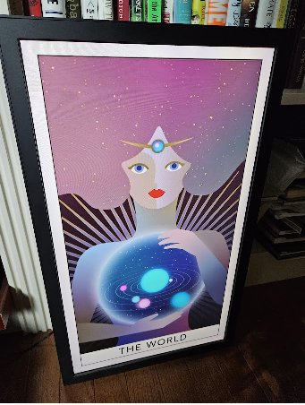

# Electric Objects Lives!  Replacement APK

## Getting started

### Requirements 

- You need a way to connect a keyboard and mouse to your EO1.  I got one of these -- https://www.amazon.com/gp/product/B01C6032G0/ -- and connected my USB keyboard to it, then my USB mouse to the keyboard.
- Flickr API key:  Once you've signed up for [Flickr](https://www.flickr.com), go [here](https://www.flickr.com/services/apps/create/apply/), to create an "app".  Once you walk through the short wizard, your key will look like a series of numbers and letters. You will want the **public key**.
- Flickr User ID:  Your user ID is in the URL bar when viewing your photos.  For example it is bolded in the following URL:  https://www.flickr.com/photos/ **193118297@N04** / — you only need the User ID, not the entire URL.
- Upon setting up the app, it'll ask for these two pieces of info.  You can either type them in on the setup dialog, or put them into a file (the User ID, followed by a carriage return, followed by your Public API key).  Name this file **"config.txt"** and copy your to your EO1's "Downloads" folder.  (An easy way to do this is to email yourself the file then log into your email and download it using the EO1's web browser [described below]).

### Setup

- Upload some EO art to your Flickr account.  There's a good collection here:  https://github.com/crushallhumans/eo1-iframe/tree/main/eo1_caches/mp4s -- MP4 videos and still images are supported.
- Once you boot up your EO1 and it hangs on the "Getting Art" dialog, hit **WINDOWS + B** to open a web browser
- You need to tell your EO1 to allow side-loading.  Swipe down on the top right and go to Settings > Security.  In there make sure "Unknown Sources" is checked.
- Go back to the browser and go to this URL: https://github.com/spalt/EO1/releases/download/0.0.5/EO1.apk
- When it finishes, install the file by pulling down the notification bar and clicking it, then agreeing to the prompts.
- Restart/power cycle your EO1
- Because this APK is designated as a "Home screen replacement", when it boots, it will ask if you want to load the Electric Object app, or the EO1 app.  Select EO1 and choose "Always".
- The first time the EO1 is run you will need to specify the information above.  Click OK to save and continue.  **To get back to the configuration screen later, push C on your connected keyboard** 
- You can now unplug your mouse and keyboard and hang your EO1 back on the wall!

### New in 0.0.5

Device app:
- Checkbox allows you to disable auto-brightness and set it manually

Partner app:
- Gear icon at top right lets you send new values for brightness, start/end quiet hour, and slideshow interval direct to the device (see 0.0.3 for instructions on installing the partner app)

### New in 0.0.4

Device app:
- Fixes quiet hours after midnight
- Fixes image and video pushing via partner app when original resolution is not available
- Better handling of bad/no network scenarios

Partner app:
- Handles intents from Flickr app in a better way (you must upgrade the partner app if you update to 0.0.4 on the device)

### New in 0.0.3

- New: "Partner App" (for Android) runs on your phone or mobile device and allows you to push images or video directly from the <A href="https://play.google.com/store/apps/details?id=com.flickr.android&hl=en_US&gl=US">Flickr Android App</a> using the share icon, assuming you are running on the same network as your EO1 device.  Running the Partner App from the Start menu of your phone allows you to skip to the next item in the current slideshow or resume the slideshow after sharing an individual item.  You can also update the current Tag (original Tag will be restored next time the device restarts).  You must allow Unknown Sources to install this app and point your phones web browser to https://github.com/spalt/EO1/releases/download/0.0.5/EO1-Partner.apk (I may publish this to the Play store in the near furture).
- Updated: Images will be displayed using the "Center Inside" cropping strategy
- Updated: Changed Flickr API to use the highest resolution image (if allowed) and video.

### New in 0.0.2

- Fixed: low resolution images
- New: Specify slideshow interval in minutes
- New: Specify showing your gallery, public gallery (items tagged "ElectricObjectsLives"), or specific tag
- New: auto-brightness based on light sensor reading
- New: quiet hours (screen will dim and not display images during this period)
- New: Top button will dim/un-dim screen
- New: Space will advance slideshow manually
- New: C opens Config screen
- More goodies coming soon :)

### Art/Contact

- I need more art!  Do you have any?  
- Questions?  danf879@gmail.com
